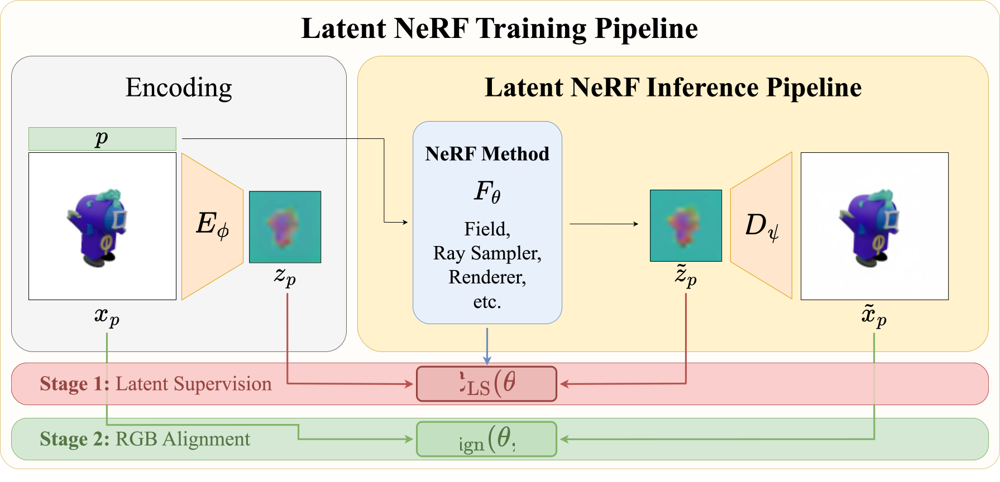
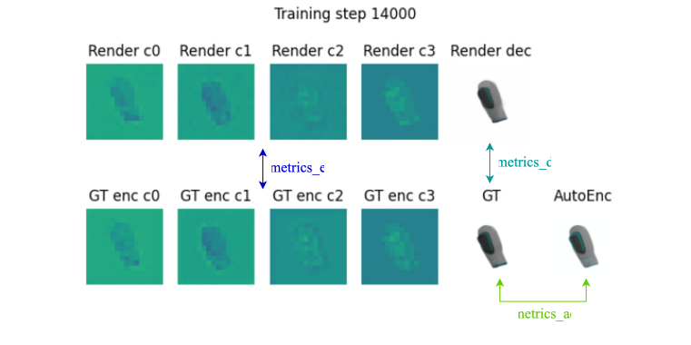

# Latent Nerfstudio Extension

> Antoine Schnepf*, Karim Kassab*, Jean-Yves Franceschi, Laurent Caraffa, Flavian Vasile, Jeremie Mary, Andrew Comport, Valérie Gouet-Brunet (* equal contributions)<br>
| [Project Page](https://ig-ae.github.io) | [Full paper](https://openreview.net/forum?id=LTDtjrv02Y) | [Preprint](https://arxiv.org/abs/2410.22936) |<br>

This repo modifies [Nerfstudio](https://github.com/nerfstudio-project/nerfstudio) to support training NeRFs in a AE latent space.
We use it to train latent NeRF architectures in our paper **Bringing NeRFs to the Latent Space: Inverse Graphics Autoencoder**.



### Environment 
Our code has been tested on:
- Linux (Debian)
- Python 3.8.19
- Pytorch 2.1.2
- CUDA 11.8
- `L4` and `A100` NVIDIA GPUs

#### With Anaconda
You can use Anaconda to create the environment:
```
conda create --name latent-nerfstudio -y python=3.8.19
conda activate latent-nerfstudio
```

Then install pytorch, tinycudann, and other dependencies:
```
pip install torch==2.1.2+cu118 torchvision==0.16.2+cu118 --extra-index-url https://download.pytorch.org/whl/cu118
 
conda install -c "nvidia/label/cuda-11.8.0" cuda-toolkit
pip install ninja git+https://github.com/NVlabs/tiny-cuda-nn/#subdirectory=bindings/torch

pip install git+https://github.com/KAIR-BAIR/nerfacc.git
```

To install the remaining requirements, execute:
```
pip install -r requirements.txt
```
#### With docker

- Edit your cuda architecture in the Dockerfile "ARG CUDA_ARCHITECTURES=XX" where XX is the architecture number (more details are available in the [nerfstudio documentation](https://docs.nerf.studio/quickstart/installation.html))
- Build the image :
```
docker build --tag dockerfile_latent-nerf -f docker/Dockerfile .
```

### Usage
Our implementation adopts the same standards as Nerfstudio and utilizes [Tyro](https://github.com/brentyi/tyro) for configuration management.

To train a latent NeRF:
```
python train.py \
<method_name> --data <path_to_scene_data> nerfstudio-data \
<vae_name> --checkpoint <path_to_vae_checkpoint>
```
where 
- method_name $\in$ {nerfacto, vanilla-nerf, tensorf, kplanes, instant-ngp},
- vae_name $\in$ {ostris, stable-diffusion}.

The `--checkpoint` argument for the VAE is optional.

Note that our code only supports the [Nerfstudio dataparser](https://docs.nerf.studio/reference/api/data/dataparsers.html#nerfstudio), and hence the data has to be formatted accordingly.

#### With docker

```
docker run --gpus all -u 0 -v <path_to_scene_data>:<path_to_scene_data> --rm -it --shm-size=12gb dockerfile_latent-nerf python train.py <your_python_command>
```


## Evaluation
We visualize and evaluate our latent NeRFs using [wandb](https://wandb.ai/site). You can find a quickstart guide [here](https://docs.wandb.ai/quickstart).
During its training, a latent NeRF can be visualized in the RGB space and latent space via the logged dashboard figure:



On this figure, the top row illustrates the channels of latent NeRF renderings (`Render c*`.) and the corresponding decoded image (`Render dec`).
The bottom row illustrate the ground truth image (`GT`), and corresponding latent encoding (`GT enc c*`), which the latent NeRF aims at reproducing. Additionally, it displays the auto-encoded reconstruction of the GT (`AutoEnc`).

Adittionaly to the above visual evaluation, we compute 3 types of metrics to quantitatively evaluate latent NeRF performances:
- `metrics_e` are metrics between the encoded image (`GT enc c*`) and the image rendered by the latent NeRF (`Render c*`). 
- `metrics_d` are metrics between the decoded rendering of the latent NeRF (`Render dec`) and the ground truth image (`GT`). It measures the quality of the latent NeRF in the RGB space. 
- `metrics_ae` are metrics between the ground truth image (`GT`) and its auto-encoded reconstruction (`AutoEnc`). It measures the performance of the auto-encoder. 

Note that, as our scenes are learned in the latent space, the default Nerfstudio [viewer interface](https://docs.nerf.studio/quickstart/viewer_quickstart.html) is not supported in our code.

## License
This code is open-source. It is shared under the [Apache 2.0 License](https://www.apache.org/licenses/LICENSE-2.0).
It modifes the code of Nerfstudio which is also licensed under the [Apache 2.0 License](https://www.apache.org/licenses/LICENSE-2.0) to support training in the latent space.
Major changes are annotated with the comment ``changes related to latent_nerfstudio``.

## Citation

If you find this research project useful, please consider citing our work:
```
@inproceedings{
    ig-ae,
    title={{Bringing NeRFs to the Latent Space: Inverse Graphics Autoencoder}},
    author={Antoine Schnepf and Karim Kassab and Jean-Yves Franceschi and Laurent Caraffa and Flavian Vasile and Jeremie Mary and Andrew I. Comport and Valerie Gouet-Brunet},
    booktitle={The Thirteenth International Conference on Learning Representations},
    year={2025},
    url={https://openreview.net/forum?id=LTDtjrv02Y}
}
```
